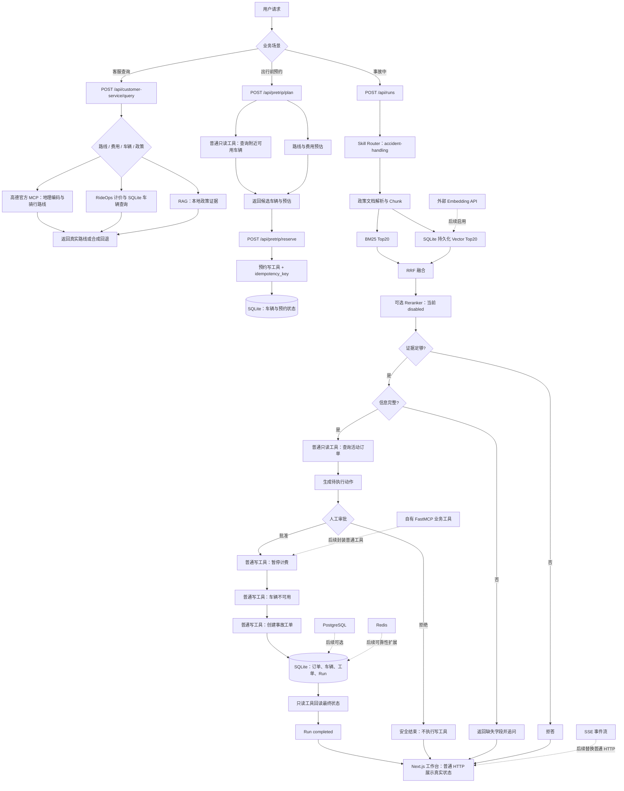

# RideOps 当前链路

下面的流程图对应当前仓库已经实现的代码。虚线部分是后续增强，不代表当前已经接入。

## 当前边界

- 当前默认使用 Mock Embedding，不调用外部模型 API。
- 当前 RAG 使用 BM25 + Mock Vector + RRF，向量索引持久化在 SQLite。
- 当前 Reranker 接口存在但默认关闭，没有用简单排序冒充真实 Reranker。
- 当前路线查询已通过 MCP Client 调用高德官方 MCP；订单、预约、事故工单等 RideOps 私有业务仍是 Python 服务内普通工具。
- 当前尚未把 RideOps 私有业务工具暴露为自有 FastMCP Server。
- 当前前端使用普通 HTTP 请求，不是 SSE。
- 当前业务数据和 Run 状态使用 SQLite，不需要 PostgreSQL、Redis 或 Docker。
